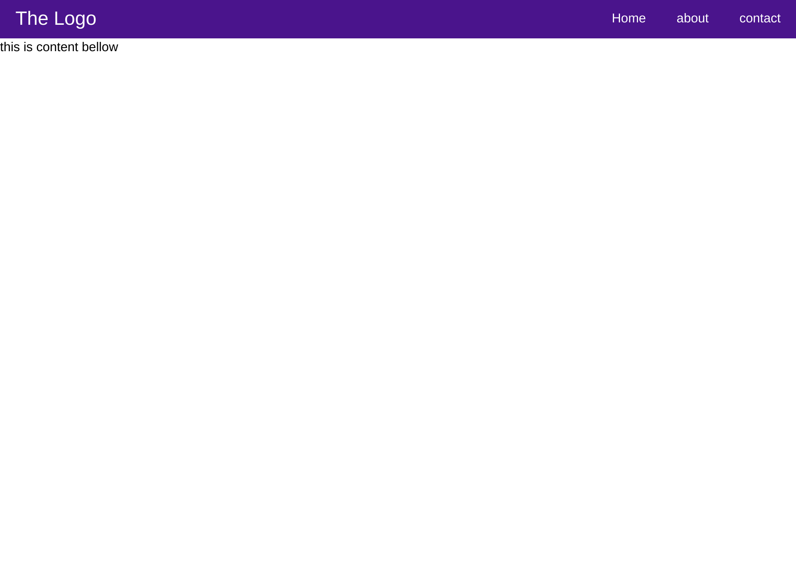
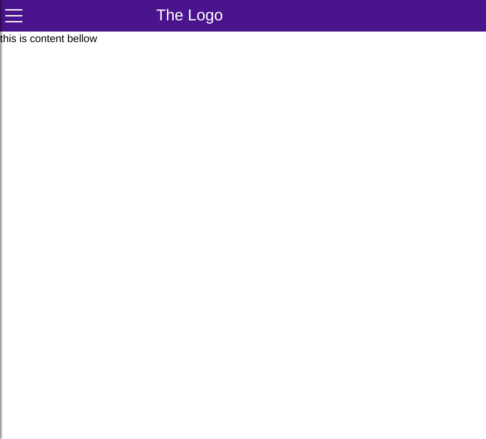
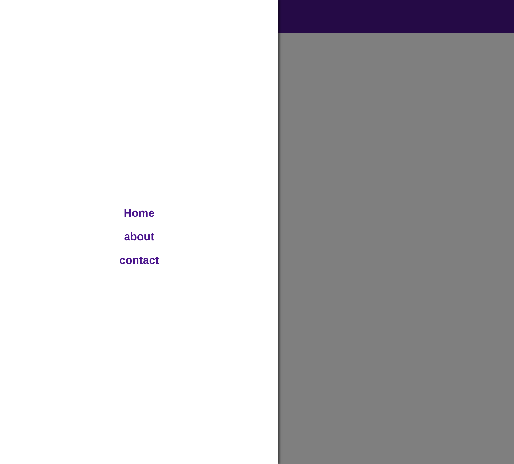

## PROJECT: SideNav and Navbar Component in React

this is a simple navigation component developed using React, CSS3 and HTML5. The navigation bar shows at the top for
desktop screens. However for smaller screens (width of 768px and below) a sidenavigation bar appears when the menu button on the left is clicked. it has a transparent backdrop that brings focus to the side navigation.

## Large screen

## small screen

## Sidenav screen

## Built With

- HTML5
- CSS3
- Reactjs

## Author

- Github: [@githubhandle](https://github.com/chirchir12)
- Twitter: [@twitterhandle](https://twitter.com/shadochir)
- Linkedin: [linkedin](https://www.linkedin.com/in/emmanuel-chirchir/)
- Email: [email](chirchir7370@gmail.com)

## Getting started

- Clone the repository with:
  `https://github.com/chirchir12/sidenavComponent.git`
- cd to `sidenavComponent`
- run `npm install`
- run `npm start`

## 🤝 Contributing

Contributions, issues and feature requests are welcome!

Feel free to check the [issues page](issues/).

## Show your support

Give a ⭐️ if you like this project!

## 📝 License

This project is [MIT](lic.url) licensed.
